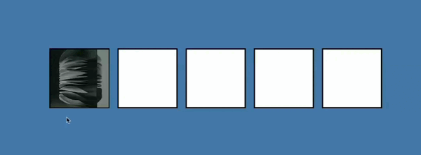

# Drag and Drop Image Project

This project allows users to interactively drag and drop random images onto one of the four empty cards. Once an image is dropped onto a card, the card will be filled with the dropped image. This provides an engaging and interactive way to organize and display images.

## Demo

Here's a short GIF demonstrating the drag and drop functionality of the project:

## Features

- Drag and drop functionality: Users can drag random images and drop them onto the empty cards.
- Interactive display: The dropped image fills the card, allowing users to organize and visualize their images easily.
- Random image selection: Images are randomly generated to provide a diverse selection for the user to drag and drop.

## Getting Started

To get started with this project, follow the instructions below:

1. Clone the repository:  
   **git clone** `https://github.com/IqbalAhmadi/drag-n-drop.git`

2. Navigate to the project directory:
   **cd drag-n-drop**

3. Open the project in your preferred code editor.

## Usage

To use the drag and drop functionality in this project, follow these steps:

1. Open the index.html file in a web browser.
2. The page will display four empty cards.
3. Drag any of the random images and drop them onto one of the empty cards.
4. The dropped image will fill the card.
5. Repeat the process to add more images to the other cards.
